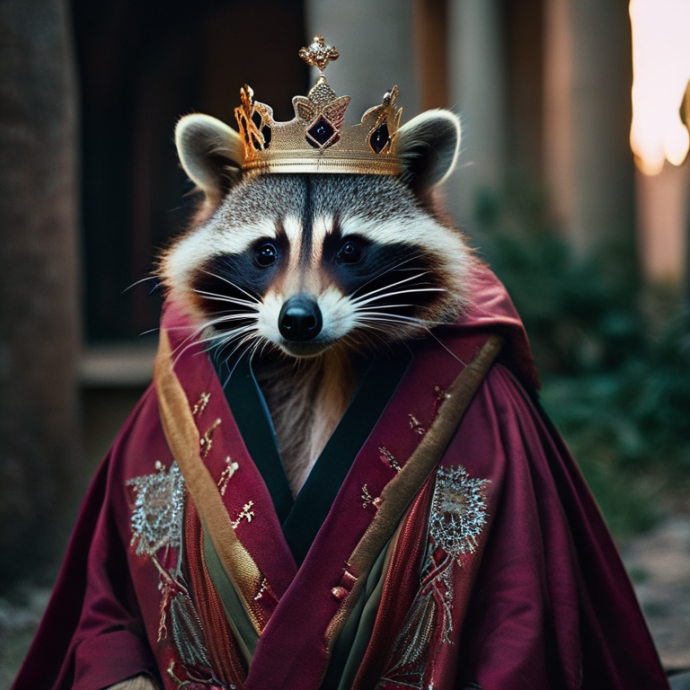
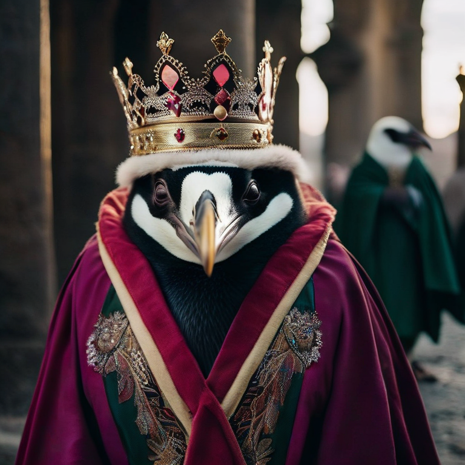

# segmind/segmind-vega Cog model

This is an implementation of the [segmind-vega](https://huggingface.co/segmind/Segmind-Vega) as a Cog model. [Cog packages machine learning models as standard containers.](https://github.com/replicate/cog)

Run predictions:

    cog predict -i prompt="A cinematic shot of a penguin wearing an intricate italian robe, with a crown -i seed=2418008291

Or img2img:

    cog predict -i image=@output.0.png -i prompt="A cinematic shot of a penguin wearing an intricate italian robe, with a crown" -i seed=4040665456

## Examples:

txt2img

img2img

